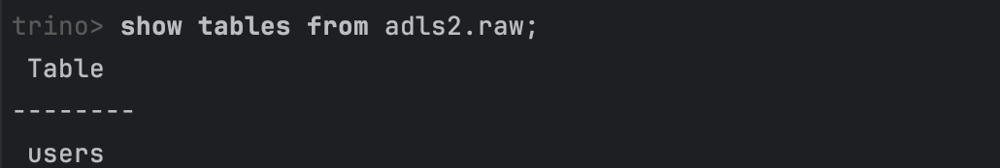
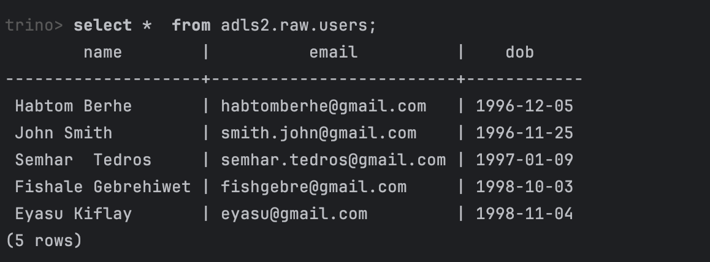

# DataCraft with Merhawi - Java Iceberg API with ADLS Integration

## Overview 🌟
This project demonstrates seamless data management in Azure Data Lake Storage Gen2 (ADLS2) using Apache Iceberg, a high-performance table format for analytics.

The application showcases:
- Creating and managing Iceberg tables.
- Writing and reading Parquet data with Iceberg's powerful APIs.
- Leveraging Hive Metastore and Azure ADLS for scalable data pipeline

## Why This Project? 🧐
- **Simplify Data Lake Management:** Manage schema evolution, partitioning, and time travel with ease using Apache Iceberg. 
- **Empower Your Azure Data Lake:** Combine the cost-effective, scalable storage of ADLS2 with Iceberg’s high-performance table format for seamless analytics. 
- **Modern Data Architecture:** Learn how Iceberg bridges the gap between traditional data lakes and warehouses, enabling ACID compliance and real-time data queries. 
- **Real-World Use Case:** Gain hands-on experience with production-ready data infrastructure that supports both batch and streaming workloads.


## Features 🛠️
- **Azure ADLS2 Connectivity:** Securely integrate your data lake with Iceberg tables.
- **Schema Management:** Automatically handle schema evolution and partitioning.
- **Efficient Data I/O:** Read and write data in Parquet format with Iceberg’s IO abstraction.
- **Logging & Debugging:** Stay informed with detailed logs for every step of the process.

## Getting Started 🚀

### Prerequisites

- Java 8 or higher
- Maven
- Azure account with access to ADLS Gen2
- Running Hive Metastore (HMS)
- SQL engine client (Trino Client in this example) 

### Project Setup 🔧

#### Clone the Repository

```git clone https://github.com/merhawi212/java-iceberg-api-adls2.git && java-iceberg-api-adls2```

#### Configuration
Create a file named ``config.properties`` in the src/main/resources directory with the following content:

```
account.key={{azure account key}}
storage.account.name={{storage account name }}
container.name=raw
thrift.url=thrift://localhost:9083
catalog.name=adls2
schema.name=raw
table.name=users
```

## Build and Run 🚦
### 1.  Build the Project:
```mvn clean compile assembly:single ```
### 2. Run the Application
You can run the application using the following command:
```java -jar target/java_iceberg_api_adls2-1.0-jar-with-dependencies.jar ```

## How It Works 🔍

### 1. Establishing Connection 🌐
The application configures - a connection to ADLS2 and Hive Metastore (HMS) using the provided config.properties.
- **Construct a base URL for ADLS2:**
```
    String baseURL = String.format("abfss://%s@%s.dfs.core.windows.net", containerName, storageAccountName); 
```

- **Configures a HiveCatalog for managing Iceberg tables:**
```
    hiveCatalog.initialize(catalogName, getCatalogProperties(...));
```

### 2. Schema Definition 📋
Defines the table schema with fields like name, email, and dob (date of birth):

```
    Schema schema = new Schema(
        Types.NestedField.required(1, "name", Types.StringType.get()),
        Types.NestedField.optional(2, "email", Types.StringType.get()),
        Types.NestedField.optional(3, "dob", Types.DateType.get())
        );
```
## 3. Creating and Managing Data 📦
- **Generate Sample Records:**
``
    List<GenericRecord> records = createGenericRecords(schema);
  ``
- **Write data to Iceberg Table**:
``  write(table, schema, records);
``
- **Read from Iceberg Table:**
``
  read(table);
``

### 4. Custom Table Location (Optional) 
You can customize the table's location within the ADLS2 while creating the table using the Apache Iceberg API.
```
private static String getTableLocation(String tableName, Map<String, String> schemaMetadata){
        String schemaLocation = hiveMetastoreDatabaseLocation(schemaMetadata);
        LOGGER.info("Schema Location: {}", schemaMetadata);
        return schemaLocation + "in/" +tableName; // custom table location
}
  
public  static String hiveMetastoreDatabaseLocation(Map<String, String> schemaMetadata){
        return schemaMetadata.get("location");
 }
    
  ```
## Example Output
Generated Sample Data:

| **Name**        |   **Email**	            | **Date of Birth** |
|-----------------|-------------------------|-------------------|
| Habtom Berhe    | habtomberhe@gmail.com   |	1996-12-05      |
| John Smith	  | smith.john@gmail.com    |	1996-11-25      |
| Semhar Tedros	  | semhar.tedros@gmail.com |	1997-01-09      |

## Trino Client (Optional)
Using Trino client to query the table.

### Show Tables:


### Select Table:

